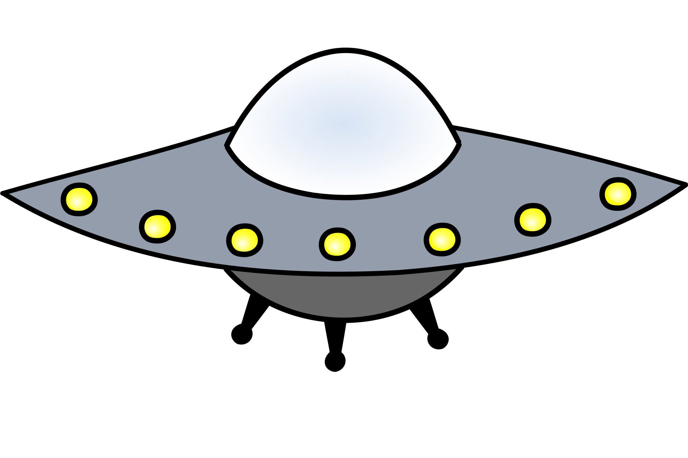
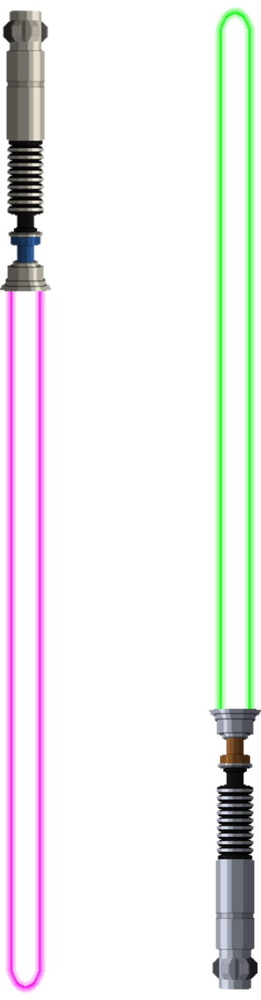

  **SpaceRun**

A FlappyBird Inspiered 2D Game set in outerspace! Steer your spaceship between dangerous lightsabers, earn points and become the all mighty space champion.
> 

  
  
*Try It Yourself (https://your-github-username.github.io/repository-name)*

### Player:

  
  
*Player Icon*

---

### Obstacles:

  
  
*Lightsabers.*

---

**Reflection**

### What went well:
- **Understanding the code:** after many struggles, i have managed to fully comprehend every piece of my code. so much so, that the physics, move functions & delta time parts were written almost by heart. never thaught i would be able to do it! 

- **Personal Impressive Recovery:** Creating a fully operating game after loosing a full 3 days of work on my original project. Managed to make The game stand on it's own 2 feet! 

### Challenges:
- **Understading the logic behind the Modules:** serious gaps in my understanding of proper code division between the files (leading to not being able to effectivly to the prepeared game template) led to a subsuntial amout of time wasted in the first 3 days on long, way-to-packed code clocks inside the game loop. tutoring session meant to help orginized it ended with the tutor's order to scrap eveything and start over, which led to a serious techniqual (and moral) blow. 
- **drawing:** was just a nightmare for me! but with a lot of help from my friends & family (mainly my artistic brother) i am pleased with the result, basic as it is .

### Lessons Learned:
- **Time Managment:** Cutting my loses and accepting my current level of expirience. i have tried to go over our lessons and recordings again during the lab to close the gaps i had. DURING THE LAB THERE IS NO TIME FOR THAT! and trying to do so anyway will only put me more behind, even though my intentions are good. i'll do what i can, the best i can, and hope for the best.
- **Drawing is Important, but not that inportant :** i have spent too much time trying to reach a professional level artwork. it's OK, but i didn't need to worry that much about it. as long as the game is playble, i will achieve my goal, even if the spaceship is not the "Mona Lisa". and i did! 
